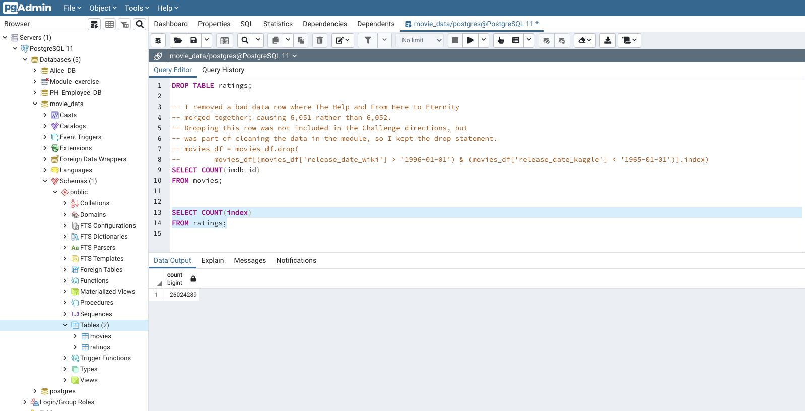
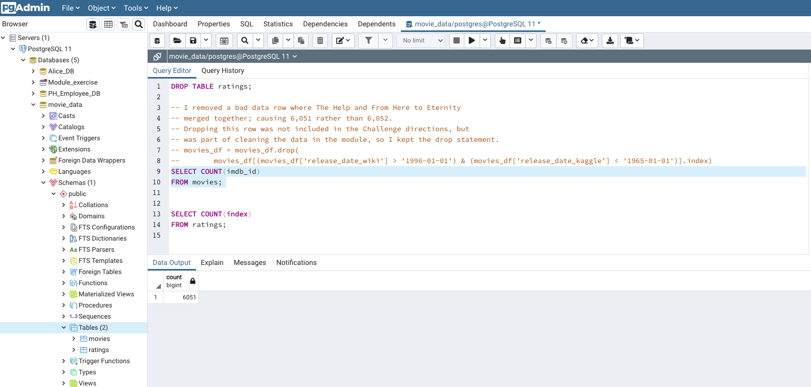
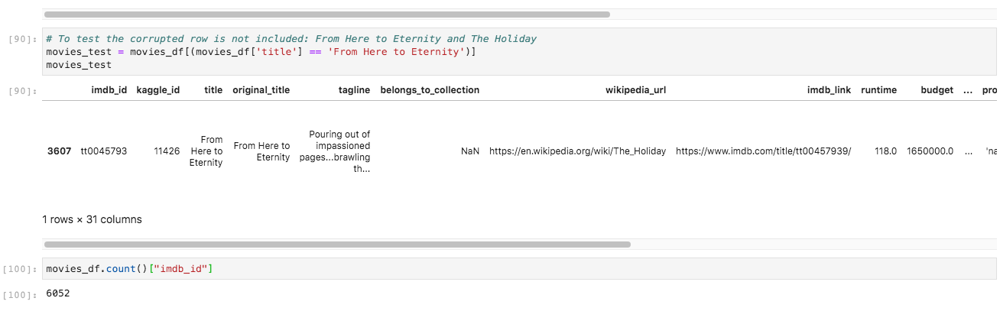

# Amazing Prime Movie Analysis

## Overview
Amazing Prime, the world's largest retailer, also provides a premiere streaming platform for tv shows and movies.  Their video team wants to develop an algorithm to predict which low budget movies will be successful so they can buy the streaming rights.  To bring a little excitement - and new talent - to the task, Amazing Prime decided to host a hack-a-thon to see if someone can come up with an algorithm to predict the popular movies.

In order to launch the hack-a-thon, the video team needs to provide the dataset for the participants; Britta, a member of the video team, has been tasked to do that. 

After going through the ETL process to clean up the source data from Wikipedia and Kaggle, which includes movie and ratings data, Britta and team are now being asked to update the code so it can be automated to update on a daily basis.

The first step in automation is to refactor the code already created in order to streamline the functions into one (1) that takes in the three files—Wikipedia data, Kaggle metadata, and the MovieLens rating data—and imports into a database.

## Objectives

To create 4 technical analysis deliverables to further automate the ETL process Britta and our team just completed.

1. Write an ETL Function to Read Three Data Files
2. Extract and Transform the Wikipedia Data
3. Extract and Transform the Kaggle data  
4. Create the Movie Database and import the merged movie database (with ratings) and the original ratings.csv file

## Resources
The raw data files include
1. movies_metadata.csv from Kaggle.com
2. wikipedia-movies.json from Wikipedia
3. ratings.csv from 

***Due to the size of the ```ratings.csv``` file, it has not been uploaded to this repository as per instructions.** The other 2 source files are located in the **Resources** folder.

## Analysis
Some of the steps taken to "clean" the Wikipedia and Kaggle data include:

* creating Pandas dataframe from the csv source files
* dropping any duplicates
* using Regular Expressions to:
	* Reformat and standardize time, date, and dollar amount formats for Running Time, Release Date, Box Office, and Budget
	* Remove unnecessary data
	* Remove any unnecessary, inferior or redundant columns
	* Remove any bad data resulting from data merge (involves 1 row)
	* Filling in blanks in ratings.csv to complete the dataframe.

Once cleaned and transformed, the merged movie data frame is further merged with the transposed ratings data.

The resulting merged dataframe is uploaded along with the original ratings.csv file into a ```movie_data``` database housed in pgAdmin and is ready for the hack-a-thon!

## Results
The ratings.csv file was successfully imported to the```movie_data``` SQL database...all 26,024,289 rows!  



Similarly, the final merged movie data is successfully imported to the ```movie_data``` database.



**Please note:**  
The total number of rows is **6,051**, rather than **6,052** as noted on the Challenge results because there was one (1) corrupt row of data that resulted after the merge between the Wikipedia dataframe and the Kaggle dataframe.  This row included Wikipedia data from "The Holiday" and Kaggle information from "From Here to Eternity" merging into one row.  In the spirit of cleaning the data, I decided to drop this row even though the instructions for the Challenge did not indicate to do so.

When the code is re-run without removing this row, the total number of rows of ```movies_df``` is **6,052**.  Below is a snapshot of the corrupt data and the new total when it is included in (i.e. not dropped from) the data frame.



Let the hack-a-thon begin!